<div align="center">
    
    <h1>💊 MedRemind : Suivi Médical & Rappels Intelligents ✨</h1>
    <p>
        <strong>MedRemind</strong> est une application dédiée au suivi des traitements médicaux : gestion des médicaments, rappels de prise, historique détaillé et statistiques d’observance. <br><br>
        Construite avec <strong>Expo</strong>, <strong>Express.js</strong> et <strong>PostgreSQL (Neon)</strong>, l’application offre une expérience fluide, fiable et sécurisée 💼. <br><br>
        Les utilisateurs peuvent gérer leurs prescriptions, suivre l’évolution de leur observance et rester informés de l’état de leur traitement 📈.
    </p>
</div>

---

## 📸 Screenshots

<div style="display: flex; justify-content: space-between; gap: 10px; flex-wrap: wrap;">

  
  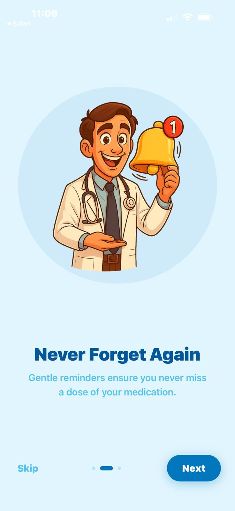
  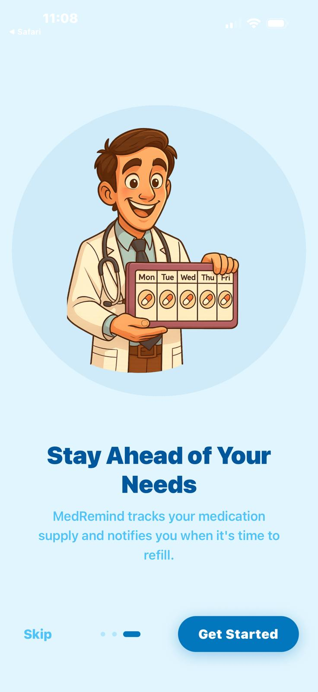

  
  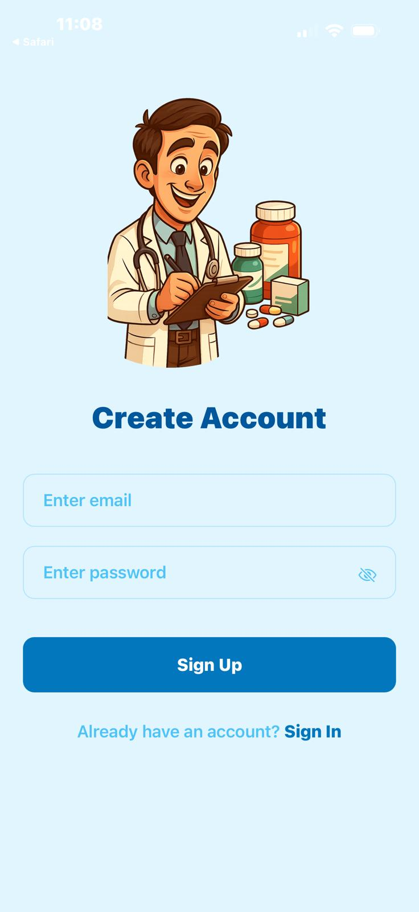
  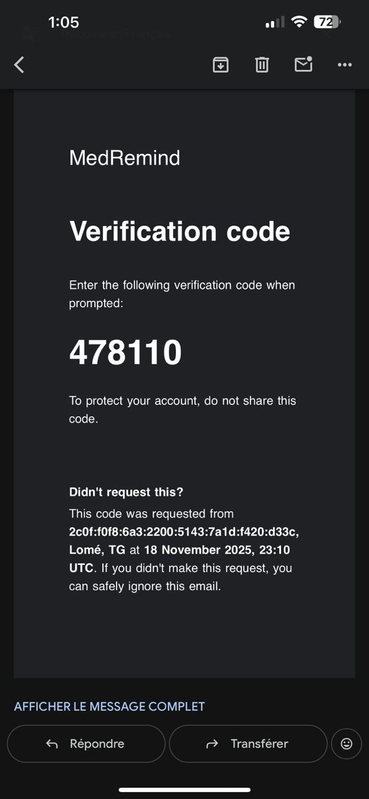

  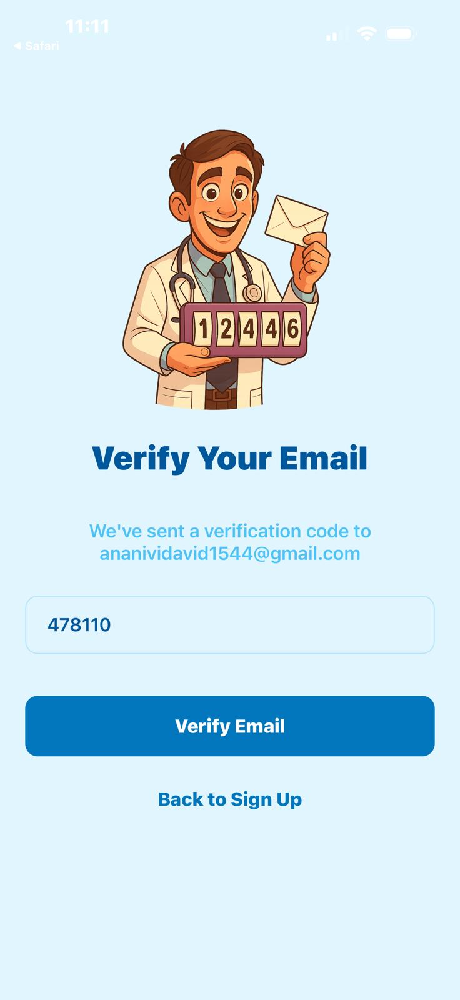
  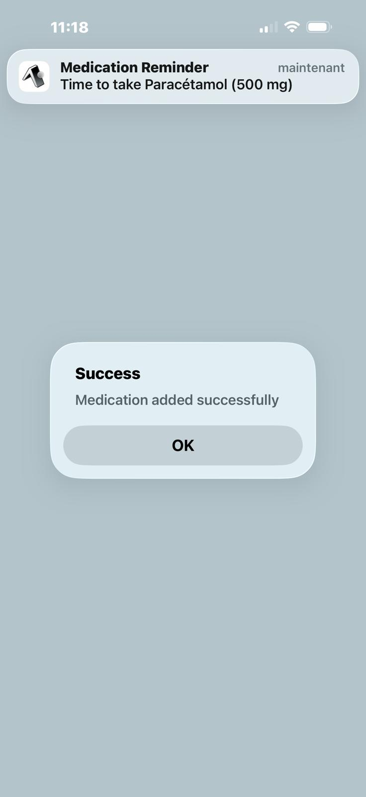
  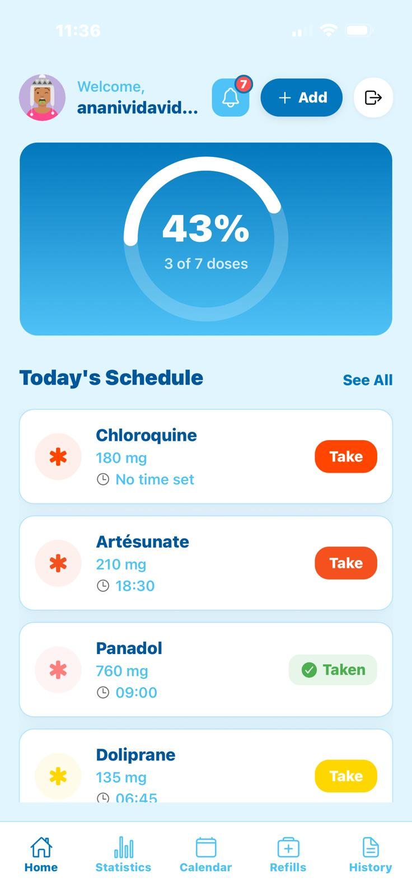

  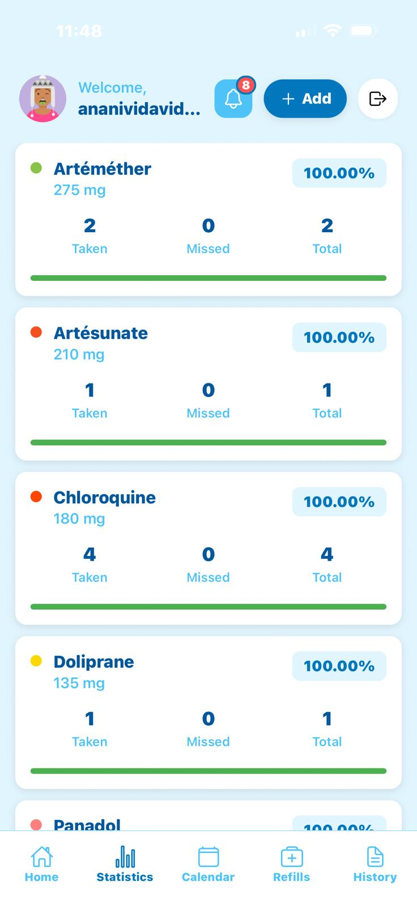
  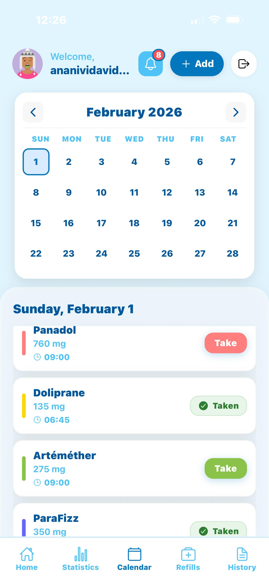
  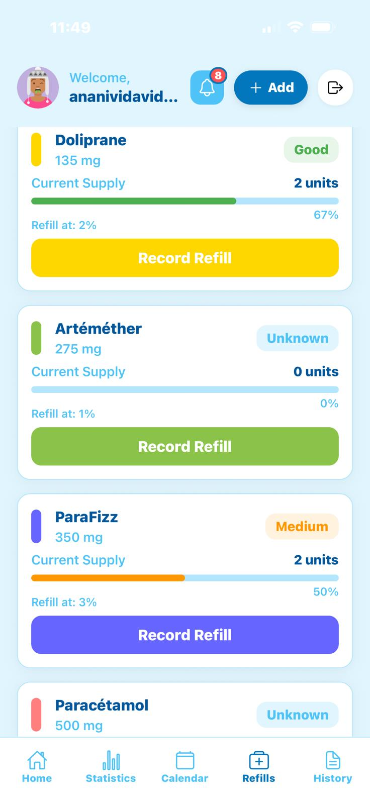

  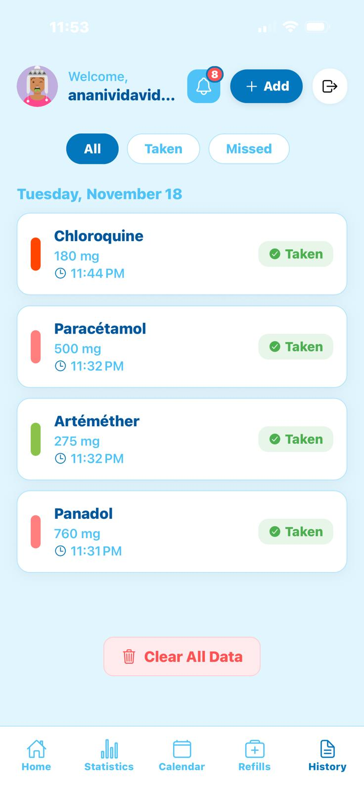
  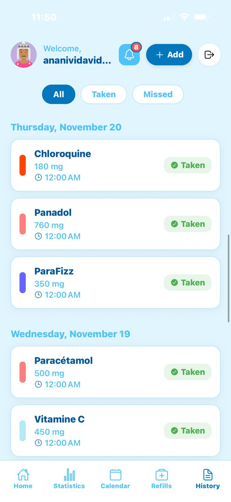
  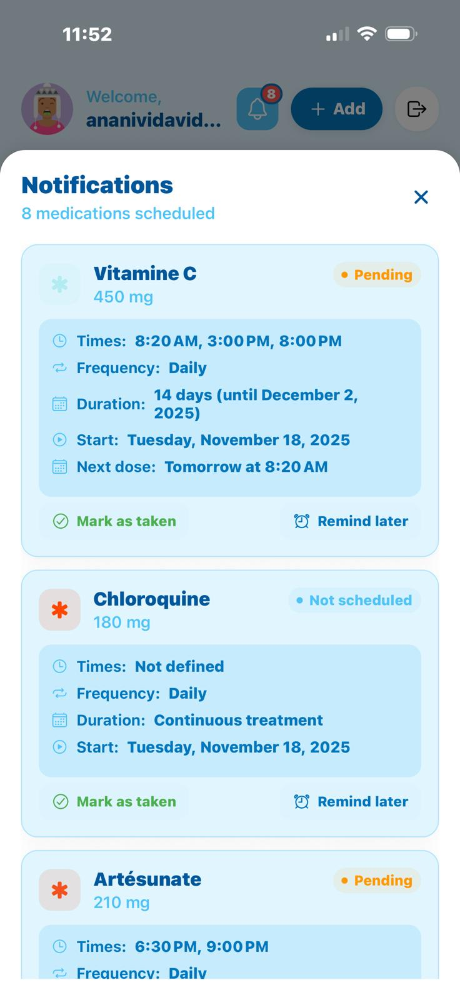

</div>

---

## ⚙️ Fonctionnalités principales

- 🔐 **Auth sécurisée (Clerk)** — JWT, middleware de protection.  
- 💊 **Gestion des médicaments** — ajout, modification, suppression, suivi du stock.  
- ⏰ **Rappels intelligents** — notifications de prise et alertes de renouvellement.  
- 📈 **Statistiques** — suivi des prises et taux d’observance.  
- 🚀 **Optimisation** — tâches planifiées, rate limiting, documentation Swagger.

---

## 🛠️ Stack technique

| Composant | Technologie |
|------------|--------------|
| Framework | Express.js |
| Base de données | PostgreSQL (Neon) |
| Authentification | Clerk |
| Cache / Limites | Upstash Redis |
| Documentation | Swagger |
| Déploiement | Render |

------------------------------------------------------------------------
## ⚙️ Installation et Démarrage

### 🔧 Prérequis

* Node.js **v18+**
* Compte **Neon PostgreSQL**
* Compte **Cloudinary**
* Compte **Resend**
* Compte **Render**

## 🧩 Configuration du fichier `.env`

### ⚙️ Backend (`/backend`)

``` bash
# Serveur
PORT=3000
NODE_ENV=development

# Base de données
DATABASE_URL=votre_url_neon_postgresql

API_URL=votre_url_déploiement

# JWT
JWT_SECRET=votre_secret_jwt

# Cloudinary
CLOUDINARY_CLOUD_NAME=votre_cloud_name
CLOUDINARY_API_KEY=votre_api_key
CLOUDINARY_API_SECRET=votre_api_secret

# Rate Limiting (Upstash Redis)
UPSTASH_REDIS_REST_URL=votre_url_redis
UPSTASH_REDIS_REST_TOKEN=votre_token_redis

```

### 📱 Mobile (`/mobile`)

``` bash
EXPO_PUBLIC_CLERK_PUBLISHABLE_KEY=<votre_cle_clerk>
```
------------------------------------------------------------------------

## 🚀 Démarrer le Projet

Suivez ces étapes pour installer MedRemind :

## 🔥 Cloner le dépôt
```bash
git clone https://github.com/Maxime015/MedRemind.git
```

------------------------------------------------------------------------

## ⚙️ Lancer le backend

``` bash
cd backend
npm install
npm run dev
```

------------------------------------------------------------------------

## 📱 Lancer le mobile

``` bash
cd mobile
npm install
npx expo start
```

------------------------------------------------------------------------

## 🤝 Contribution

Les contributions sont les bienvenues :  

1. Cloner le dépôt
2. Créer une branche
3. Apporter vos modifications
4. Créer une Pull Request détaillée

------------------------------------------------------------------------

## 📄 Licence

Projet sous licence **MIT**.  
Développé avec ❤️ pour une meilleure observance thérapeutique.

## Contact

Pour toute question ou suggestion:

- [Maxime ANANIVI](mailto:maximeananivi@gmail.com)

Happy coding!
